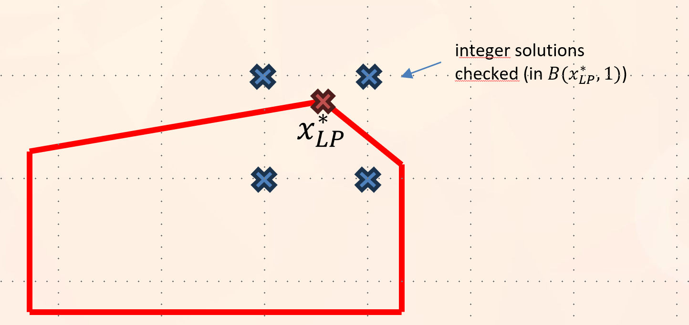
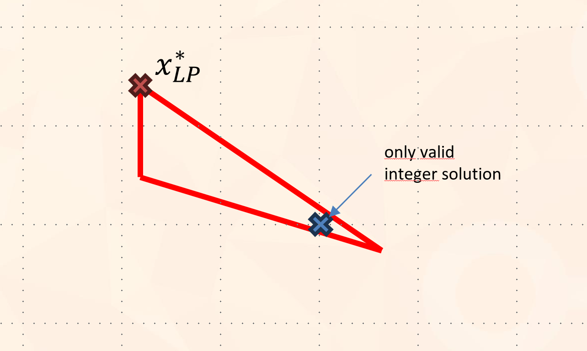

# Operation Research

OR methods for Linear Programming and Integer Programming, with a focus on the VM Placement problem

# VM Placement Problem

This problem consist of placing a set of VMs on a set of servers, with the goal of minimizing the number of servers used. This is a NP-hard problem, and can be formulated as a Linear Programming problem, in particular, in it's original form, as a Binary Integer Programming problem.

### Problem Formulation

- We note $x_{ij}$ the binary decision variable that is equal to 1 if the VM $j$ is placed on the server $i$, and 0 otherwise.
- There are $n$ servers and $m$ VMs
- The goal is to minimize the number of servers used, so we introduce the variable $y_i$ which is equal to 1 if the server $i$ is used, and 0 otherwise. The goal is to minimize the following objective function:
  $$\sum_{i=1}^{n} y_i$$
- For each ressource $k$ (CPU, RAM, Disk, Network), we note $c_{ik}$ the capacity of the server $i$ for the ressource $k$, and $a_{jk}$ the consumption of the VM $j$ for the ressource $k$.
- Any server cannot be overloaded, so we have the following constraint for each server $i$ and each ressource $k$:
    $$\sum_{j=1}^{m} a_{jk} \times x_{ij} \leq c_{ik} \times y_i$$
- Any VM must be placed on exactly (or more than?) one server, so we have the following constraint for each VM $j$:
  $$\sum_{i=1}^{n} x_{ij} = 1$$
  We could potentially relax this constraint to allow the VM to be placed on several servers.

# Problem Generation

The VMP instances are generated artificially. The VM data is generated following random distributions (uniform, constant...) that can be defined in the `configs/problem/<problem tag>.yaml` files, where `<problem tag>` is the tag of the VMP variation problem you want to generate. For example, for the default VMP problem, the file is `configs/problem/vmp.yaml`.

The server data is generated from the VM data, which allows the problem to be feasible and provides an upper bound on the optimal solution, and an almost-lower bound on any solution. In details, it does the following :

- generate the $m$ VMs following configured distributions
- group those VMs in $k$ groups, with $k \le n$
- generate $k$ servers (the optimal servers) whose capacities are the sum of the requirements of those matrix, plus a small (stochastic) bonus
- generate $n-k$ other servers, each of them being 'altered copies' from one of the optimal servers, with capacities reduced by a (stochastic) malus.

This unsure that :
- the problem is always solvable (by using the initial configuration of the optimal servers for example)
- the optimal solution's value is at most $k$ (the feasible optimal server is an upper bound on the optimal solution)
- if the other server malus is sufficiently high, they become not interesting to pick which ensures that the optimal solution is the feasible optimal server
- this ensures that the optimal solution value is $k$, if the bonus is sufficiently small and the malus is sufficiently high.

The configuration for the problem generation can be found in the `configs/problem/vmp.yaml` file.

# Solving the problem

For solving this problem, you can use one of the implemented algorithms using this command :

```bash
python run.py algo=<algo tag> problem=vmp
```

Where `<algo tag>` is the tag of the algorithm you want to use, and `vmp` is the tag of the problem you want to solve.

For example, for using the Pyomo solver, you can use the following command :

```bash
python run.py algo=pyo problem=vmp
```

This will print the data generation as well as the solution found by the algorithm.

Algorithms, along their tags, currently implemented are :
- `ff` : First Fit algorithm. An online algorithm that places the VMs on the servers in a greedy way, by placing the VM on the first server that has enough resources.
- `ffd` : First Fit Decreasing algorithm. The same as the First Fit algorithm, but the VMs are sorted by decreasing order of their capacities before being placed. 
- `bf` : Best Fit algorithm. An online algorithm that places each VM $j$ on a server $i$ that 1) host the VM and 2) has currently the least averaged normalized capacity.
- `lp_around` : solve the LP relaxation of the problem, and search randomly around it the valid integer solution.
- `bnb` : solve the problem using a Branch and Bound algorithm.
- `pyo` : formalize the problem under the Pyomo framework and solve it using a MILP solver.


# Algorithms


### First Fit

This algorithm is a simple online algorithm that places the VMs on the servers in a greedy way, by placing the VM on the first server that has enough resources.

### First Fit Decreasing

The same as the First Fit algorithm, but the VMs are sorted by decreasing order of their capacities before being placed. 

Because their are several ressources, we use the "averaged normalized capacity" of the VMs to sort them. This is the mean of the normalized ressource capacities, which are the capacities divided by the maximum capacity : $\tilde c_i = \text{mean}_k( \frac{c_{ik}}{\max_{i'} (c_{i'k})} )$.

### Best Fit

This algorithm is an online algorithm that places each VM $j$ on a server $i$ that 1) host the VM and 2) has currently the least averaged normalized capacity. The normalized capacity of a server is the sum of the normalized capacities of the VMs placed on it, and the normalized capacity of a VM is the sum of the normalized capacities of the servers that host it.

### LP Relaxation + Random Around

This algorithm solve the relaxation of the problem (using the scipy.optimize.linprog function) and then try many solutions around the relaxation. It does that by randomly rounding to the inferior or superior integer each integer variable that was not integer in the relaxation solution, so mathematically, it is searching in the ball $B(x_{LP}^*,1)$ under the norm $L_{\infty}$.

<p align="center">
  
</p>

It does that until it has found a solution that is integer. It then keep searching to eventually improve the solution's objective value.

Note that because there are this algorithm is very slow, because there are $O(2^{m})$ solutions to test, and that the search is not informed.

It is not guaranteed to give the optimal solution, and even to give a valid solution, because the problem has no guarantee to have a valid solution in $B(x_{LP}^*,1)$, as you can see in this example :

<p align="center">
  
</p>

Improvements :
- It can do slightly better by sampling the solutions without replacement. 
- If no solutions are found in the ball, it can increase the radius of the ball and try again.

### Branch and Bound

This algorithm is a classic Branch and Bound algorithm. It is a recursive algorithm that explores the solution space by branching on the integer variables. It uses a depth-first search to explore the solution space, and uses a best-first search to explore the tree. It uses a lower bound on the solution to prune the tree, and uses the LP relaxation solution as a lower bound.

### Pyomo

This is not an algorithm made by myself, but simply an implementation of the problem under the Pyomo framework, which is a Python library for optimization problems. This very efficient commercial library gives lower bound on the solution of any algorithms I will certainly implement, and is much faster.


# VM Placement Problem variants

### 1) Affinity rules between some of the VMs

This can happen for example if some VM work better if deployed on the same physical machine, or if some VMs should not be deployed on the same physical machine for security reason for example.

In the same-server case, it is equivalent to additionate the two VMs capacities, i.e. to merge the two VMs into one.

In the different-server case, we have the following constraint : for any pair (j,j') of uncompatible VMs, and any server $i$:
$$x_{i,j} + x_{i,j'} \leq 1$$
This means that if the VM $j$ is placed on the server $i$, then the VM $j'$ cannot be placed on the same server.

This variant is implemented as the class `problems.vmp_with_incompatibilities.VMPlacementProblemWithIncomp` and it's configuration can be found in the `configs/problem/vmp_incomp.yaml` file.

You can use the following command to solve the problem with this variant (the tag is `vmp_incomp`):

```bash
python run.py algo=<algo tag> problem=vmp_incomp
```

### 2) Case where all servers are partly occupied vs totally empty and all with the same characteristics

The case where all servers have not the same capacities is the default case in this implementation.

The case where all servers are identical and are initially empty can be obtained by associating all server capacities to the max capacities. 

This variant is implemented as the class `problems.vmp_splittable.VMPlacementProblemSplittable` and it's configuration can be found in the `configs/problem/vmp_split.yaml` file.

You can use the following command to solve the problem with this variant (the tag is `vmp_empty`):

```bash
python run.py algo=<algo tag> problem=vmp_empty
```


#### 3) VMs could be splitted over several servers

This is a case where it is possible to split the deployment of any VM on $k$ servers, with $k$ a given integer. This is not equivalent to the linear relaxation case, where $k$ would be equal to the number of servers. In this case the VM can be split but not infinitely. Additionnally, one could add the constraint that each assignment of a VM to the server should be at least equal to a given fraction $\alpha$ of the VM capacity, because it makes little sense to assign an infinitesimal part of a VM to a server.

In this case, we can relax the integer constraint and set the bounds at (0,1). We now need to force the number of non-null $x_{i,j}$ to be inferior to $k$.

For this, we introduce the variable $z_{i,j}$ which is equal to 1 if the VM $j$ is partially placed on the server $i$, and 0 otherwise : $z_{i,j} = 1_{x_{i,j} \neq 0}$. 

We can obtain this with the constraints $z_{i,j} \geq x_{i,j}$ and $z_{i,j} * \epsilon \leq x_{i,j}$, with $\epsilon$ a small positive number.

We then have the following constraint for each VM $j$:
$$\sum_{i=1}^{n} z_{i,j} \leq k$$

If we want each assignment of a VM to the server to be at least equal to a given fraction $\alpha$ of the VM capacity, we simply have to set $\epsilon$ to $\alpha$.

This variant is implemented as the class `problems.vmp_splittable.VMPlacementProblemSplittable` and it's configuration can be found in the `configs/problem/vmp_split.yaml` file.

You can use the following command to solve the problem with this variant (the tag is `vmp_split`):

```bash
python run.py algo=<algo tag> problem=vmp_split
```

#### 4) Consider VMs families, each family is given a criticity level between 1 to 3

In this case, the VMs are split in three families. VMs from the family 1 need ot be isolated from VMs from the family 3, and VMs from the family 2 are free.

This can be considered as a spcial case of the incompatibility case : for each VM $j$ from the family 1, and each VM $j'$ from the family 3, and any server $i$:
$$x_{i,j} + x_{i,j'} \leq 1$$

This variant is implemented (with more flexibility on the family incompatibilities) as the class `problems.vmp_families.VMPlacementProblemWithIncompFamilies`, which is a subclass of the `VMPlacementProblemWithIncomp` class and it's configuration can be found in the `configs/problem/vmp_families.yaml` file.

You can use the following command to solve the problem with this variant (the tag is `vmp_families`):

```bash
python run.py algo=<algo tag> problem=vmp_families
```

# Results

Results were obtained by using 10 different seeds for each problem and algorithm, and by logging the `isFeasible` and `objective_value` values of the solution found by the algorithm.

Results are accessible on the WandB platform, at the following link : https://wandb.ai/timotheboulet/operational_research.

For nice visualization, we advise you to :
- create an account on WandB
- group runs (using the (around) top left button 'group' on WandB) by, under that order :
  - problem.name (so that you can compare algorithms on the same problem)
  - problem.config.n_servers (so that you can compare algorithms on the same instance (because the number of servers vary between `vmp_small`, `vmp` and `vmp_big`))
  - algo.name (this will group runs by algorithm, giving an overview of the performance of each algorithm)
- compare algorithms problem by problem (and instance by instance for the VM Placement case) by only showing runs of a certain  problem.name.